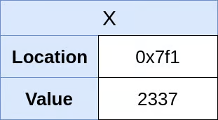

# **Python Object Model**

### **PyObject**

- Everything in Python is an Object.
- In the Heap memory, every object is represented using a C struct called PyObject.
- Three attributes:
    - reference type - to manage memory.
    - type - to ensure type safety.
    - value - the actual value.
- There are two types of objects in Python:
    - Immutable objects - internal state cannot be changed after creation.
    - Mutable objects - can be modified.

## **Variables / Python Names**

- Unlike other languages, Python does not assign values to variables. It binds variables/names to values.
- The object owns the memory space, not the variables.

### **Variables in C vs Python**

| **Assignment** | **C** | **Python** |
| --- | --- | --- |
| **Code** | `int x = 2337` | `x = 2337` |
| **Steps** | 1. Allocate memory. | 1. Create a PyObject.
| |           2. Assign the value. | 2. Set the type to int and value to 2337.
| |           3. Point x to the value. | 3. Create a variable x and point to the PyObject.
| |           4. Increase reference count to 1. |

**Memory Layout**

<div>
     
    
</div style="margin-bottom:100px">
<br>

| **Reassignment** | **C** | **Python** |
| --- | --- | --- |
| **Code** | `int x = 2338` | `x = 2338` |
| **Steps** | 1. Variable x is mutable. | 1. Create a new PyObject.
|           | 2. Assign a new value of 2338 to x. | 2. Set the type to int and value to 2338.
|           | 3. The previous value is overwritten. | 3. Create a variable x and point to the PyObject.
|           |           | 4. Increase reference count of new object to 1.
|           |           | 5. Decrease reference count of old object by 1.

**Memory Layout**

<div>
     
    
</div style="margin-bottom:50px">
<br>

| **Copying** | **C** | **Python** |
| --- | --- | --- |
| **Code** | `int y = x` | `y = x` |
| **Steps** | 1. A new memory space is created and assign variable y to it.| 1. Since the object is already present.
|           | 2. Copies the value from x to y. | 2. A new variable y is created and pointed toward object 2338.
|           | 3. The values are the same, but two memory spaces are created. | 3. Reference count of 2338 is incremented.|
|           |           | 4. x and y points to the same object. |

**Memory Layout**

<div>
     
    
</div style="margin-bottom:50px">
<br>


| **Modification** | **C** | **Python** |
| --- | --- | --- |
| **Code** | `y = y + 1` | `y += 1` |
| **Steps** | 1. Get the value of y and increment by 1. | 1. Get the value of y and increment by 1.
|           | 2. Re-assign the calculated value to y. | 2. Create a new PyObject with the new value.
|           |           | 3. Point y to the new PyObject.
|           |           | 4. Decrease the reference count of the old PyObject.
|           |           | 5. Increase the reference count of the new PyObject.

**Memory Layout**

<div>
     
    
</div style="margin-bottom:50px">
<br>

## **Intern Objects**

- Python pre-creates a certain subset of objects in memory and keeps them in the global namespace for everyday use.
- Python Interpreter interns the following:
    - Integer numbers between `5` and `256`
    - Strings less than length 20 and contain ASCII letters (`A` to `Z` and `a` to `z`), digits, and underscores only.

```python
>>> s1 = "Hello World!"
>>> s2 = "Hello World!"
>>> s1 is s2
False
```

- To manually intern strings, use `sys.intern()`