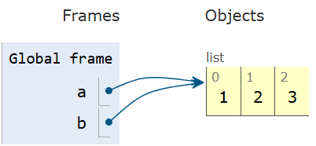

# Immutable vs Mutable

### **Immutable**

- Objects whose internal state **cannot be changed.**
- **Examples** - Numbers, Strings, Tuples, and Frozen sets.

### **Mutable**

- Objects whose internal state **can be changed.**
- **Examples** - List, set, and dict.
- User-defined data types can be made mutable or immutable.

---

### **Characteristics**

1. **Modification**
    - Mutable objects - modified **in place** with the same memory address.
    - Immutable objects - cannot be changed. Any changes will create a new object.
2. **Performance**
    - Immutable objects - faster for read-only operations.
    - Mutable objects - efficient for frequent updates.
3. **Hash** **ability**
    - Immutable objects - hashable, can be used as keys in dictionaries or elements in sets (e.g., `tuple`).

---

### **Shared References**

**1. Mutable Objects:**

- Changes to a mutable object are reflected in all references pointing to it because they share the **same memory location**.
- Example:
    
    ```python
    a = [1, 2, 3]
    b = a  # `a` and `b` point to the same list
    b.append(4)
    print(a)  # [1, 2, 3, 4]
    ```
    
    
    
    
    

**2. Immutable Objects:**

- Changes create a **new object**, leaving the original object unchanged.
- References to the original object remain unaffected.
- Example:
    
    ```python
    x = 10
    y = x
    y += 5
    print(x)  # 10 (unchanged)
    print(y)  # 15 (new object)
    ```
    

---

### Function Arguments

1. **Mutable Objects**
    - **Pass-by-Reference:** The reference to the same object is passed.
    - Modifications inside the function affect the original object.
    - Example:
    
    ```python
    nums = [1, 2, 3, 4, 5]
    print(id(nums)) # 140046009853504
    
    def squares_in_place(numbers):
        print(id(numbers)) # 140046009853504
        for i, num in enumerate(numbers):
            numbers[i] = num ** 2
        return numbers 
    
    res = squares_in_place(nums)
    print(res) # [1, 4, 9, 16, 25] # 140046009853504
    ```
    


Initial setup up to function call.


Modified input list.

```python
def squares_of_temp(numbers):
    temp = []
    for num in numbers:
        temp.append(num ** 2)
    return temp 

res = squares_of_temp(nums)
print(nums, id(nums)) # 140046009853504, The original list is not modified.
print(res, id(res)) # 2707652734720
```


1. **Immutable Objects:**
    - **Pass-by-Value:** A copy of the reference is passed.
    - Modifying the argument inside the function does not affect the original object.
    - Example:
    
    ```python
    counter = 0
    print(id(counter)) # 140705411199752
    
    def increment(count):
        print(id(count)) # 140705411199752
        count += 1 
        return count 
    
    ans = increment(counter)
    print(counter, ans) # 0 1
    ```
    
    
    
    Initial setup
    
    
    
    original object is unmodified.
    
    To modify the global variable, use the global keyword.
    
    ```python
    def increment():
        global counter
        counter += 1 
        return counter 
    
    ans = increment()
    print(counter, ans) # 1 1
    ```
    
    
    
    
    

---

### Mutable Default Arguments

- Mutable default arguments (e.g., `list`, `dict`) retain changes made during previous calls.
- The same object is reused across all calls to the function unless explicitly reset.
- **Issue** - unintended shared state.
- Example:

```python
def increment(value, counter = []):
    counter.append(value)
    return counter

increment(2)
ans = increment(4)
print(ans) # [2, 4]

# To avoid this behavior use None  
def increment(value, counter = None):
    if counter is None:
        counter = []
        counter.append(1)
    return counter

increment(2)
ans = increment(4)
print(ans) # [1]
```


Use case - Caching and storing states across function calls.

```python
def fibo_num(n, cache={0:1, 1:1}):
    if n not in cache:
        cache[n] = fibo_num(n - 1) + fibo_num(n - 2) 
    return cache[n]

res = fibo_num(10)
print(res) 
```

---

### Augmented Assignment (+=, -=)

1. **Immutable Objects**
    - Augmented assignment creates a new object and reassigns the reference.
    - The original object remains unchanged.
    - x = x + 1 and x += 1 are similar.
    - Example:
    
    ```python
    x = (1, 2)
    y = x
    x += (3, 4) # x = x + (3, 4)
    print(x is y, x) # False (1, 2, 3, 4)
    ```
    
    
    

```python
# Edge case with tuple assignment
x = (1, 2, [3, 4])
y = x
x[2] += [5, 6] # throws an error, but list will be modified. because item assignment is not possible in tuple.
```


1. **Mutable Objects**
    - Augmented assignment modifies the existing object without creating a new one.
    - All references to the object will be updated.
    - x = x + 1 - Creates a new object.
    - x += 1 - does in-place modifications.
    - Example:
    
    ```python
    x = [1,2]
    y = x
    x = x + [3, 4]
    print(x is y, x) #False, [1, 2, 3, 4]
    x += [3, 4]
    print(x is y, x) #True [1,2,3,4]
    ```
    


creates a new object


modifies the existing object.